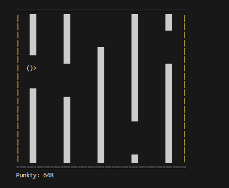

# Console Flappy Bird 🐦

Klasyczna gra Flappy Bird przeniesiona do konsoli systemu Windows, napisana w czystym język C. Projekt obsługuje fizykę lotu, wykrywanie kolizji oraz system zapisu najlepszych wyników.



## 🎮 Funkcje

* **Silnik fizyczny:** Zaimplementowana grawitacja i pęd skoku.
* **Proceduralne generowanie:** Przeszkody (filary) generują się w losowych miejscach.
* **System wyników:** Gra zapisuje wyniki do pliku i wyświetla **TOP 3** graczy po zakończeniu rozgrywki.
* **Dynamiczna trudność:** Parametry mapy i gry zmieniają się w zależności od wybranego poziomu.

## 🏆 Poziomy trudności

Gra oferuje 3 zbalansowane poziomy trudności:

| Poziom | Prędkość gry | Wielkość mapy | Rozmiar "dziury" | Punkty za klatkę |
| :--- | :--- | :--- | :--- | :--- |
| **Easy** | Wolna | Mała | Duża | 3 pkt |
| **Normal** | Średnia | Średnia | Standardowa | 5 pkt |
| **Hard** | Bardzo szybka | Duża | Mała | 12 pkt |

## 🕹️ Sterowanie

* **[ SPACJA ]** - Skok (machnięcie skrzydłami)
* **[ Q ]** - Wyjście z gry (Quit)

## 🛠️ Kompilacja i Uruchomienie

Projekt został napisany pod system **Windows** (wykorzystuje biblioteki `windows.h` oraz `conio.h`).

### Wymagania
* Kompilator GCC (np. MinGW)
* System operacyjny Windows

### Instrukcja
1. Sklonuj repozytorium:
   ```bash
   git clone https://github.com/Preeksik/Console-Flappy-Bird.git
2. Skompiluj kod:
   ```bash
   gcc main.c -o flappy.exe
3. Odpal gre:
   ```bash
   ./flappy.exe

💾 System zapisu (Leaderboard)

Gra automatycznie tworzy plik wyniki.txt w folderze z grą. Zapisywane są tam:

    Nick gracza

    Uzyskany wynik

Po każdej przegranej algorytm sortuje wyniki i wyświetla podium. 

Author: Preeksik
